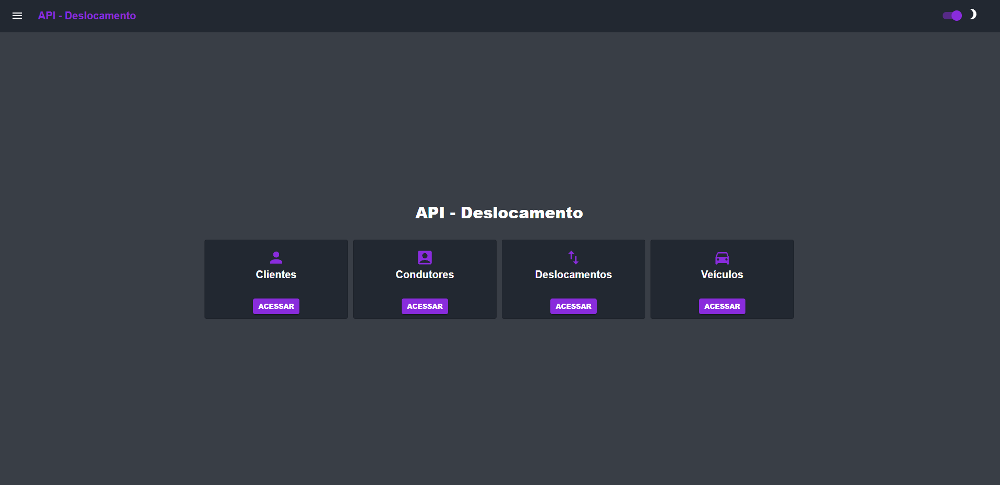

---

## 💻 Sobre 

O objetivo do projeto é criar uma aplicação CRUD (Create, Read, Update, Delete) com a API-Deslocamento e conectá-la ao Front-End desenvolvido com NextJS e MUI.

--- 

## 🚀 Link do projeto hospedado na Vercel (clique para entrar)

<a href="https://api-deslocamento-gtz3m2vkb-luc4sdev.vercel.app/" target="_blank" rel="external">

</a>
<h2>Link: <a href="https://api-deslocamento-gtz3m2vkb-luc4sdev.vercel.app/" target="_blank" rel="external">Acesse aqui</a></h2>


--- 

## 💻 Pré-requisitos

Antes de começar, verifique se você atendeu aos seguintes requisitos:
* Você tem uma máquina `<Windows / Linux / Mac>`
* Você instalou a versão mais recente do `NodeJS`


## ⚙️ Instalando

Para instalar execute no terminal:

npm:
```
npm i
```

yarn:
```
yarn install
```

## 🚀 Rodando o projeto

Para rodar o projeto, execute no terminal:

npm:
```
npm run dev
```
yarn:
```
yarn dev
```

## 🚀 Tecnologias utilizadas

O projeto está desenvolvido utilizando as seguintes tecnologias:

- ReactJS 
- NextJS 
- MUI
- APIRest
- Axios
--- 


